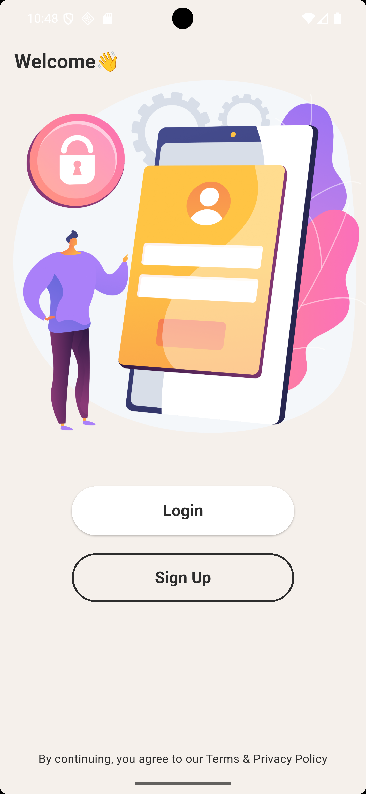
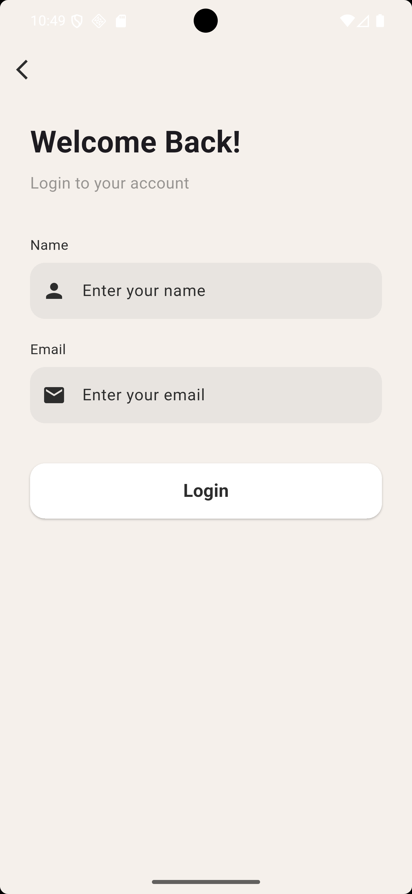
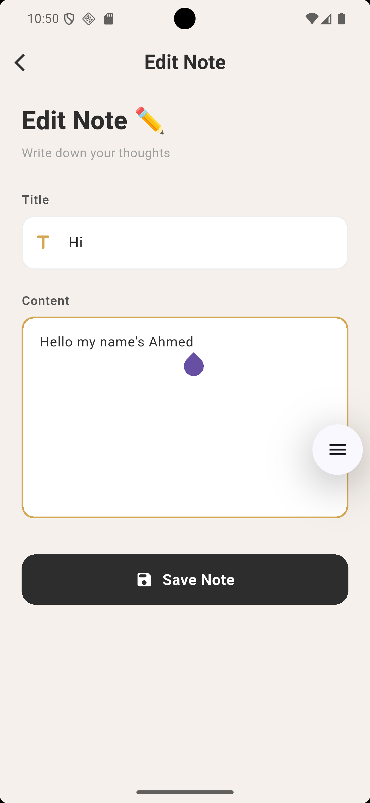
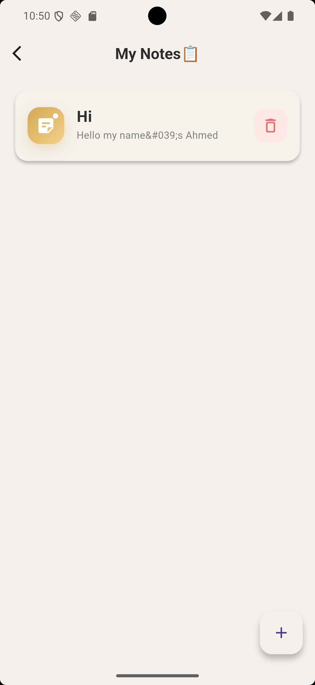

# Note App

A Flutter notes application connected to a PHP API. The app supports account
sign up, login, viewing notes, adding notes, editing notes, and deleting notes.

## Preview


## Screenshots

| Welcome | Login |
| --- | --- |
|  |  |

| Notes List | Edit Note |
| --- | --- |
|  |  |

## Features

- User sign up and login through API requests.
- Save session data locally with `shared_preferences`.
- View notes for the logged-in user.
- Add new notes with title and content.
- Edit existing notes.
- Delete notes with a confirmation dialog.
- Responsive UI using `flutter_screenutil`.

## Tech Stack

- Flutter
- Dart
- HTTP API integration with the `http` package
- Local session storage with `shared_preferences`
- PHP backend endpoints

## Project Structure

```text
lib/
  Api_Call/
    CRUD.dart
    LinkApi.dart
  Auth/
    Login.dart
    Sign.dart
  Model/
  widget/
    addBage.dart
    editBage.dart
    request_Home.dart
  Homo.dart
  main.dart
images/
  Login.png
  screenshots/
    welcome.png
    login.png
    notes-list.png
    edit-note.png
Fonts/
  JetBrainsMono-Bold.ttf
```

## API Configuration

The API base URL is configured in:

```text
lib/Api_Call/LinkApi.dart
```

Current local Android emulator URL:

```dart
const String baseurl = "http://10.0.2.2/CourseTwoPHP";
```

Update this value if your PHP backend is hosted on a different server.

## Getting Started

1. Install Flutter.
2. Clone the repository.
3. Install dependencies:

```bash
flutter pub get
```

4. Make sure the PHP backend is running.
5. Run the app:

```bash
flutter run
```

## Dependencies

Main packages used by this project:

- `http`
- `shared_preferences`
- `flutter_screenutil`

## Notes

This project is intended for learning Flutter API integration and CRUD
operations with a simple notes backend.
